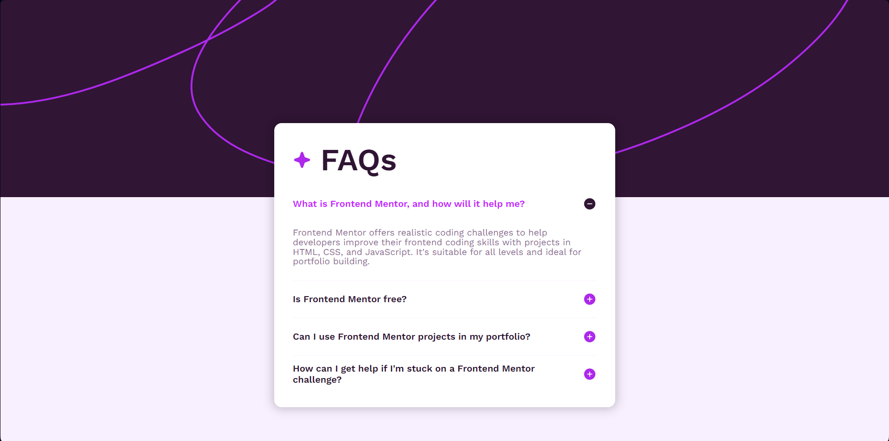
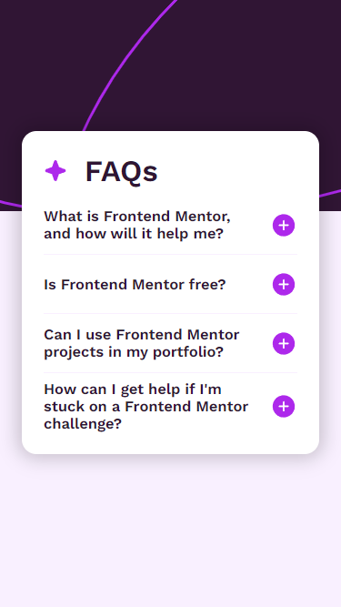

# Sección de preguntas frecuentes

_"Este proyecto es una propuesta de solución para uno de los desafios de Frontend Mentor, todos los recursos utilizados fueron obtenidos mediante dicha plataforma"_ 

El siguiente repositorio contempla el desarrollo de una página web que muestra una sección de preguntas frecuentes sobre un tema en particular.

## Contenidos

- [Descripción](#descripción)
  - [Desafío](#desafío)
  - [Screenshot](#screenshot)
  - [Links](#links)
- [Proceso](#proceso)
  - [Hecho con](#hecho-con)
  - [Lo que aprendí](#lo-que-aprendí)

## Descripción

### Desafío

Como desafío propuesto se tuvo como idea utilizar técnicas y muestras de contenido accesibles para el usuario.

La particularidad del desafío es la no necesidad de utilizar JavaScript para la página web, el contenido mostrado utiliza solamente HTML y CSS.

### Screenshot

#### Escritorio


#### Movil


### Links

- Sitio: [Sección de preguntas frecuentes](https://f-avalos.github.io/FAQ-Accordion/)

## Proceso

### Hecho con

- HTML
- CSS
  - Flexbox
  - Grid

### Lo que aprendí

Para este desafío aprendi a utilizar las etiquetas ```<details/>``` y ```<summary/>```, de esta manera pude mostrar el contenido en forma de acordeón sin necesidad de utilizar JavaScript u otro tipo de programación, el contenido solo fue estilizado con CSS.